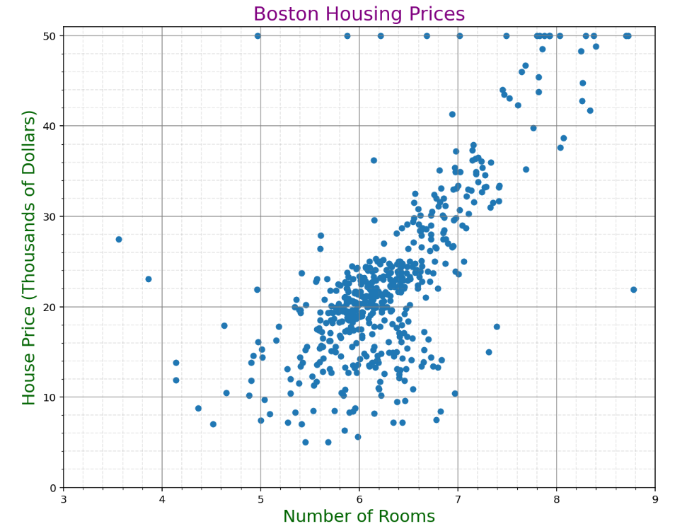
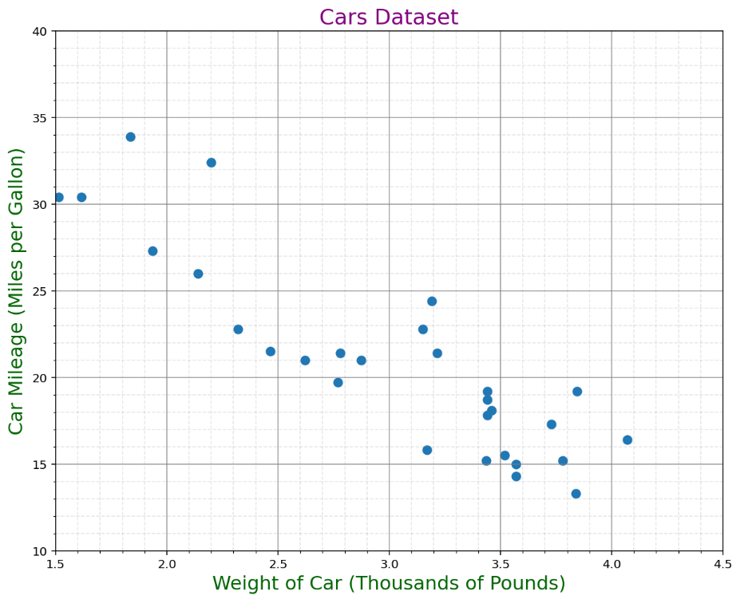
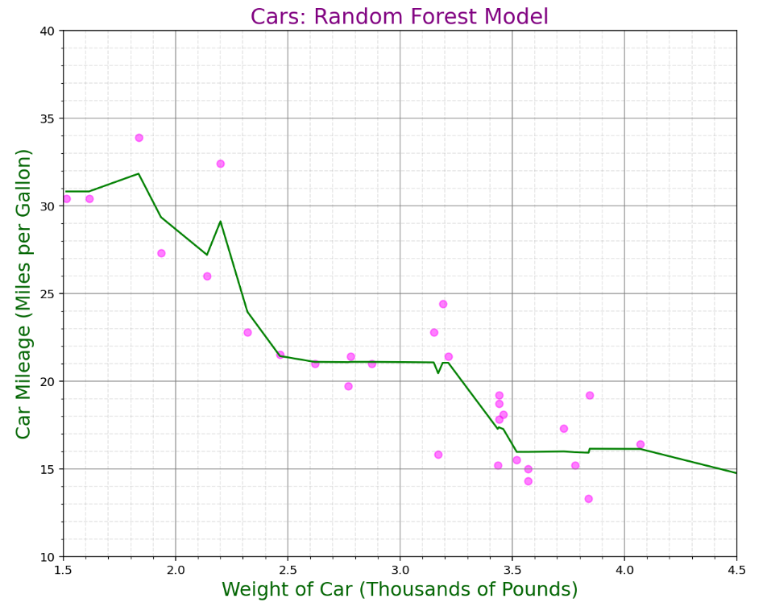
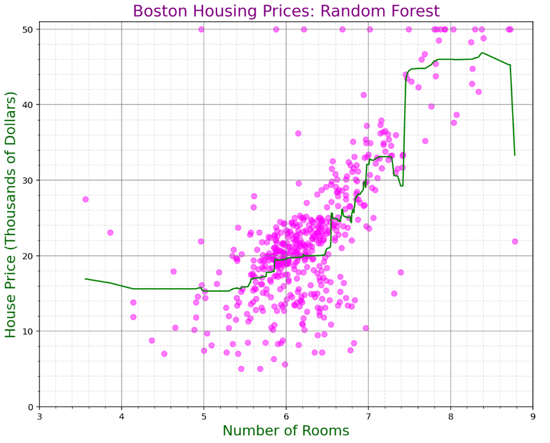
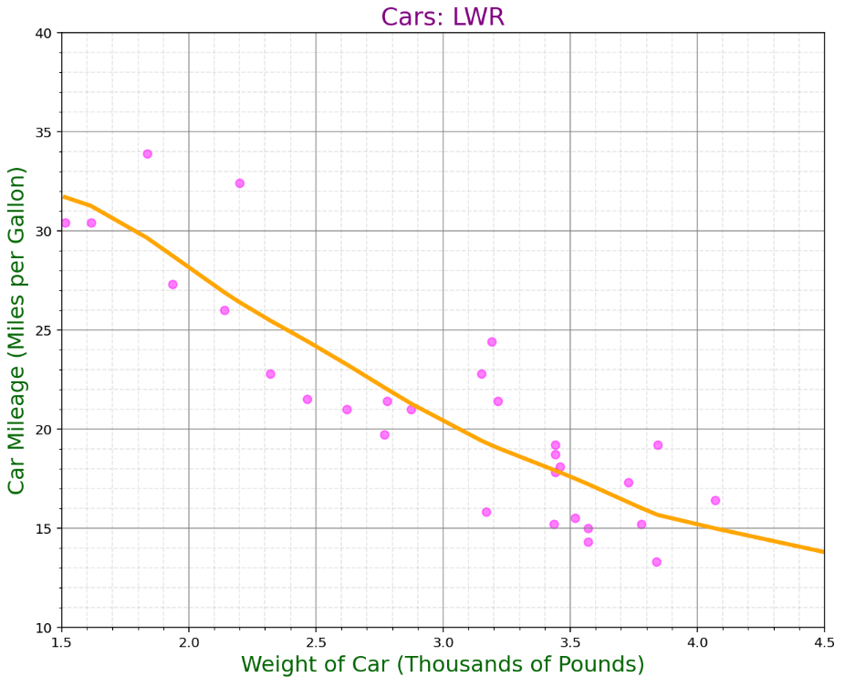
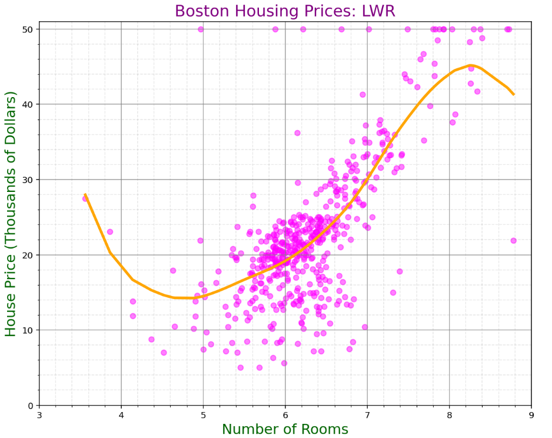

# Project 2

## Locally Weighted Pregression

Locally weighted regression (LWR) is a regression based form of modelling. Its main feature is that it is able to fit a complex relationship between a target and its feature(s) while maintaining a smooth curve.

Mathematically, we can understand LWR by first looking at the principle equation of linear regression:


We can weight this equation by some W by multiplying it to both sides:


The usual weight used in LOESS is the tri cubic weight kernel. The weight on a given x using this kernel is:


Now let's try to convey this in code:

```Python
def lowess_kern(x, y, kern, tau):

    # tau is called bandwidth K((x-x[i])/(2*tau))

    n = len(x)
    yest = np.zeros(n)

    #Initializing all weights from the kernel function by using only the train data    
    w = np.array([kern((x - x[i])/(2*tau)) for i in range(n)])     
    
    #Looping through all x-points
    for i in range(n):
        weights = w[:, i]
        b = np.array([np.sum(weights * y), np.sum(weights * y * x)])
        A = np.array([[np.sum(weights), np.sum(weights * x)],
                    [np.sum(weights * x), np.sum(weights * x * x)]])
        theta, res, rnk, s = linalg.lstsq(A, b)
        yest[i] = theta[0] + theta[1] * x[i] 

    return yest
```

This function takes some input features in matrix  and targets in , a kernel which will dictate our weights, and a parameter tau which controls the number of points the function will consider "local" (in other words, the smoothness of the curve). Next, we will write the function enumerating our tricubic kernel.

```Python
def tricubic(x):
    if len(x.shape) == 1:
        x = x.reshape(-1,1)
    d = np.sqrt(np.sum(x**2, axis = 1))
    return np.where(d>1,0,70/81*(1-d**3)**3)
```

Now we're ready to go with real data! First, let's cover the method we will be comparing LWR against.

## Random Forest

Unlike LWR, random forest models use decision trees to estimate. Specifically, in the training phase of the model, a series of decision trees are made on a number of bootstrapped subsets of the data, with some given maximum depth. Then, the results of each of these decision trees is averaged to give a final estimate. We will use a random forest model from the scikit learn library for our model:

```Python
from sklearn.ensemble import RandomForestRegressor as RFR
model = RFR(n_estimators = 120, max_depth = 3)
```

## Data

Our data comes from two common datasets, mtcars and Boston housing prices.

```Python
import numpy as np
import pandas as pd
cars = pd.read_csv("mtcars.csv")
BHP = pd.read_csv('Boston Housing Prices.csv')
```

Our features will be weight and number of rooms, and the targets will be mpg and median price, respectively.

```Python
xcars = cars[['wt']]
ycars = cars[['mpg']]

xBHP = BHP[['rooms']]
yBHP = BHP[['cmedv']]
```

Here are the scatter plots of the relationships between these pairs of variables:





## Modeling

First we will use both methods to model the mtcars dataset.

```Python
from sklearn.metrics import mean_absolute_error
model.fit(xcars, ycars)
ypred = model.predict(xcars)
matrix = np.column_stack([xcars, ypred])
ordered = matrix[np.argsort(matrix[:,0])]
```


```Python
model.fit(xBHP, yBHP)
ypred = model.predict(xBHP)
matrix = np.column_stack([xBHP, ypred])
ordered = matrix[np.argsort(matrix[:,0])]
```



## Lowess Kernel

```Python
kern = tricubic

def tricubic(x):
    if len(x.shape) == 1:
        x = x.reshape(-1,1)
    d = np.sqrt(np.sum(x**2, axis = 1))
    return np.where(d>1,0,70/81*(1-d**3)**3)

def lowess_kern(x, y, kern, tau):

    # tau is called bandwidth K((x-x[i])/(2*tau))

    n = len(x)
    yest = np.zeros(n)

    #Initializing all weights from the kernel function by using only the train data    
    w = np.array([kern((x - x[i])/(2*tau)) for i in range(n)])     
    
    #Looping through all x-points
    for i in range(n):
        weights = w[:, i]
        b = np.array([np.sum(weights * y), np.sum(weights * y * x)])
        A = np.array([[np.sum(weights), np.sum(weights * x)],
                    [np.sum(weights * x), np.sum(weights * x * x)]])
        theta, res, rnk, s = np.linalg.lstsq(A, b)
        yest[i] = theta[0] + theta[1] * x[i] 

    return yest
    
    dat = np.concatenate([xcars,ycars], axis=1)

# this is sorting the rows based on the first column
dat = dat[np.argsort(dat[:, 0])]

dat_test = np.concatenate([xcars,ycars], axis=1)
dat_test = dat_test[np.argsort(dat_test[:, 0])]

Yhat_lowess = lowess_kern(dat[:,0],dat[:,1],tricubic,0.6)

datl = np.concatenate([dat[:,0].reshape(-1,1),Yhat_lowess.reshape(-1,1)], axis=1)

from scipy.interpolate import interp1d
f = interp1d(datl[:,0], datl[:,1],fill_value='extrapolate')
yhat = f(dat_test[:,0])
```



```Python
dat = np.concatenate([xBHP,yBHP], axis=1)

# this is sorting the rows based on the first column
dat = dat[np.argsort(dat[:, 0])]

dat_test = np.concatenate([xBHP,yBHP], axis=1)
dat_test = dat_test[np.argsort(dat_test[:, 0])]

Yhat_lowess = lowess_kern(dat[:,0],dat[:,1],tricubic,0.6)
datl = np.concatenate([dat[:,0].reshape(-1,1),Yhat_lowess.reshape(-1,1)], axis=1)
f = interp1d(datl[:,0], datl[:,1],fill_value='extrapolate')
yhat = f(dat_test[:,0])
```



## Final Results

- For the cars dataset, the MAE for the random forest model was 1.427, and for the LWR model was 2.110.
- For the Boston Housing Prices Dataset, the MAE for the random forest model was 3.909, and for the LWR model was 4.041.

Thus, while slight, we can claim that for both of our test cases, the *random forest model* performed better.


